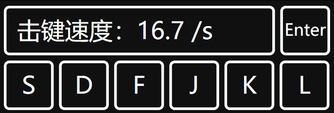

# MuseDashKeyDisplay

<p align="center">
    
</p>

## 简介

这是一个用来实时显示 Muse Dash 或其他 4k 音游按键状态的小工具。
**目前这还是一个紧急赶工出来的程序，其键位和 UI 布局均为硬编码，故不具有可扩展性，未来可能会进行重构。**

## 构建

```shell
dotnet publish
```

完整的独立应用程序会在 `MuseDashKeyDisplay\bin\Release\net5.0-windows` 目录生成。

## 特性


- 窗口置顶且半透明，可通过拖拽窗口顶部移动窗口（用 WindowChrome 实现）。
- 实时显示 S、D、F、J、K、L 按键状态
- 使用 “+”、“-” 键缩放窗口
